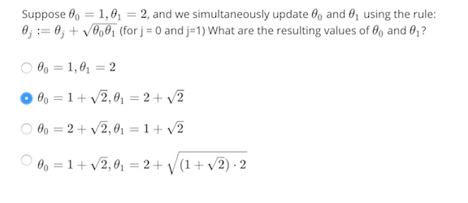

Gradient Descent
==================
So we have our hypothesis function and we have a way of measuring how well it fits into the data. Now we need t
o estimate the parameters in the hypothesis function. That's where gradient descent comes in.

Imagine that we graph our hypothesis function based on its fields θ0 and θ1 (actually we are 
graphing the cost function as a function of the parameter estimates). We are not graphing x and y itself, but the 
parameter range of our hypothesis function and the cost resulting from selecting a particular set of parameters.

We put θ0 on the x axis and θ1 on the y axis, with the cost function on the vertical z axis. 
The points on our graph will be the result of the cost function using our hypothesis with those specific theta 
parameters. The graph below depicts such a setup.

 

We will know that we have succeeded when our cost function is at the very bottom of the pits in our graph, i.e. 
when its **value is the minimum**. The red arrows show the minimum points in the graph.

The way we do this is by taking the derivative (the tangential line to a function) of our cost function. The 
slope of the tangent is the derivative at that point and it will give us a direction to move towards. We make 
steps down the cost function in the direction with the steepest descent. The size of each step is determined by 
the parameter α, which is called the learning rate.

For example, the distance between each 'star' in the graph above represents a step determined by our parameter α. 
A smaller α would result in a smaller step and a larger α results in a larger step. The direction in which the step 
is taken is determined by the partial derivative of J(θ0, 01). Depending on where one 
starts on the graph, one could end up at different points. The image above shows us two different starting points 
that end up in two different places.

The gradient descent algorithm is:

repeat until convergence:

_θj := θj − α ∂&frasl;∂θj J(θ0, 01)_

where

j = 0, 1 represents the feature index number.

At each iteration j, one should simultaneously update the parameters θ1, θ2,..., θn. 
Updating a specific parameter prior to calculating another one on the j(th) iteration would yield to a 
wrong implementation.

 

### Review
 

Answer:

Given,
θj := θj + &#8730;(θ0θ1), where θ0 = 1 and θ1 = 2

Therefore,

θ0 := θ0 + &#8730;(θ0θ1)

θ0 := 1 + &#8730;(1 x 2)

**θ0 := 1 + &#8730;2**

and

θ1 := θ1 + &#8730;(θ0θ1)

θ1 := 2 + &#8730;(1 x 2)

**θ1 := 2 + &#8730;2**

## Gradient Descent Intuition
In this video we explored the scenario where we used one parameter θ1 and plotted its cost function to 
implement a gradient descent. Our formula for a single parameter was :

Repeat until convergence:

_θ1 := θ1 − α ∂&frasl;∂θ1J(θ1)_

Regardless of the slope's sign for ∂&frasl;∂θ1 eventually converges to its 
minimum value. The following graph shows that when the slope is negative, the value of θ1 increases and 
when it is positive, the value of θ1 decreases.

On a side note, we should adjust our parameter α to ensure that the gradient descent algorithm converges in a 
reasonable time. Failure to converge or too much time to obtain the minimum value imply that our step size is wrong.

**Q.** **Suppose θ1 is at a local optimum of J(θ1), such as shown in the figure.**

What will one step of gradient descent 
θ1 := θ1 − α∂&frasl;∂θ1 J(θ1) do?

  1. Leave θ1 unchanged
  1. Change θ1 in a random direction
  1. Move θ1 in the direction of the global minimum of J(θ1)
  1. Decrease θ1

A:  Leave θ1 unchanged

**How does gradient descent converge with a fixed step size α?**

The intuition behind the convergence is that ∂&frasl;∂θ1J(θ1) approaches 0 
as we approach the bottom of our convex function. At the minimum, the derivative will always be 0 and thus we get:

_θ1 := θ1 − α∗0_

## Gradient Descent For Linear Regression