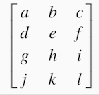
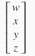
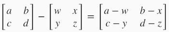
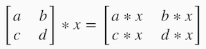
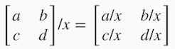
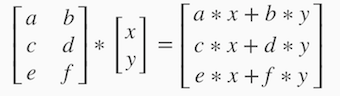

Linear Algebra
==================

## Matrices and Vectors
Matrices are 2-dimensional arrays:

 

The above matrix has four rows and three columns, so it is a 4 x 3 matrix.

A vector is a matrix with one column and many rows:

 

So vectors are a subset of matrices. The above vector is a 4 x 1 matrix.

### Notation and terms:

  - _A<sub>ij</sub>_ refers to the element in the ith row and jth column of matrix A.

  - A vector with 'n' rows is referred to as an 'n'-dimensional vector.
  
  - _v<sub>i</sub>_ refers to the element in the ith row of the vector.
  
  - In general, all our vectors and matrices will be 1-indexed. Note that for some programming languages, 
  the arrays are 0-indexed.
  
  - Matrices are usually denoted by uppercase names while vectors are lowercase.
  
  - "Scalar" means that an object is a single value, not a vector or matrix.
  
  -  ℝ refers to the set of scalar real numbers.
  
  - ℝ<sup>n</sup> refers to the set of n-dimensional vectors of real numbers.
  
Run the cell below to get familiar with the commands in Octave/Matlab. Feel free to create matrices and vectors and 
try out different things.

```
% The ; denotes we are going back to a new row.
A = [1, 2, 3; 4, 5, 6; 7, 8, 9; 10, 11, 12]

% Initialize a vector 
v = [1;2;3] 

% Get the dimension of the matrix A where m = rows and n = columns
[m,n] = size(A)

% You could also store it this way
dim_A = size(A)

% Get the dimension of the vector v 
dim_v = size(v)

% Now let's index into the 2nd row 3rd column of matrix A
A_23 = A(2,3)
```

Result after execution

```
A =

    1    2    3
    4    5    6
    7    8    9
   10   11   12

v =

   1
   2
   3

m =  4
n =  3
dim_A =

   4   3

dim_v =

   3   1

A_23 =  6
```

## Addition and Scalar Multiplication
Addition and subtraction are **element-wise**, so you simply add or subtract each corresponding element:

 

Subtracting Matrices:

 

To add or subtract two matrices, their dimensions must be **the same**.

In scalar multiplication, we simply multiply every element by the scalar value:

 

In scalar division, we simply divide every element by the scalar value:

 

Experiment below with the Octave/Matlab commands for matrix addition and scalar multiplication. 
Feel free to try out different commands. Try to write out your answers for each command before running the cell below.

```
% Initialize matrix A and B 
A = [1, 2, 4; 5, 3, 2]
B = [1, 3, 4; 1, 1, 1]

% Initialize constant s 
s = 2

% See how element-wise addition works
add_AB = A + B 

% See how element-wise subtraction works
sub_AB = A - B

% See how scalar multiplication works
mult_As = A * s

% Divide A by s
div_As = A / s

% What happens if we have a Matrix + scalar?
add_As = A + s
```

Results after execution,

```
A =

   1   2   4
   5   3   2

B =

   1   3   4
   1   1   1

s =  2
add_AB =

   2   5   8
   6   4   3

sub_AB =

   0  -1   0
   4   2   1

mult_As =

    2    4    8
   10    6    4

div_As =

   0.50000   1.00000   2.00000
   2.50000   1.50000   1.00000

add_As =

   3   4   6
   7   5   4

```

## Matrix-Vector Multiplication
We map the column of the vector onto each row of the matrix, multiplying each element and summing the result.

 

The result is a vector. The number of **columns** of the matrix must equal the number of **rows** of the vector.

An **m x n** matrix multiplied by an **n x 1** vector results in an m x 1 vector.

Below is an example of a matrix-vector multiplication. Make sure you understand how the multiplication works. 
Feel free to try different matrix-vector multiplications.

```
% Initialize matrix A 
A = [1, 2, 3; 4, 5, 6;7, 8, 9] 

% Initialize vector v 
v = [1; 1; 1] 

% Multiply A * v
Av = A * v
```

Results after execution,

```
A =

   1   2   3
   4   5   6
   7   8   9

v =

   1
   1
   1

Av =

    6
   15
   24

```