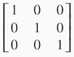
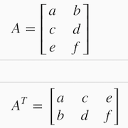

Linear Algebra
==================

## Matrices and Vectors
Matrices are 2-dimensional arrays:

 

The above matrix has four rows and three columns, so it is a 4 x 3 matrix.

A vector is a matrix with one column and many rows:

 

So vectors are a subset of matrices. The above vector is a 4 x 1 matrix.

### Notation and terms:

  - _A<sub>ij</sub>_ refers to the element in the ith row and jth column of matrix A.

  - A vector with 'n' rows is referred to as an 'n'-dimensional vector.
  
  - _v<sub>i</sub>_ refers to the element in the ith row of the vector.
  
  - In general, all our vectors and matrices will be 1-indexed. Note that for some programming languages, 
  the arrays are 0-indexed.
  
  - Matrices are usually denoted by uppercase names while vectors are lowercase.
  
  - "Scalar" means that an object is a single value, not a vector or matrix.
  
  -  ℝ refers to the set of scalar real numbers.
  
  - ℝ<sup>n</sup> refers to the set of n-dimensional vectors of real numbers.
  
Run the cell below to get familiar with the commands in Octave/Matlab. Feel free to create matrices and vectors and 
try out different things.

```
% The ; denotes we are going back to a new row.
A = [1, 2, 3; 4, 5, 6; 7, 8, 9; 10, 11, 12]

% Initialize a vector 
v = [1;2;3] 

% Get the dimension of the matrix A where m = rows and n = columns
[m,n] = size(A)

% You could also store it this way
dim_A = size(A)

% Get the dimension of the vector v 
dim_v = size(v)

% Now let's index into the 2nd row 3rd column of matrix A
A_23 = A(2,3)
```

Result after execution

```
A =

    1    2    3
    4    5    6
    7    8    9
   10   11   12

v =

   1
   2
   3

m =  4
n =  3
dim_A =

   4   3

dim_v =

   3   1

A_23 =  6
```

## Addition and Scalar Multiplication
Addition and subtraction are **element-wise**, so you simply add or subtract each corresponding element:

 

Subtracting Matrices:

 

To add or subtract two matrices, their dimensions must be **the same**.

In scalar multiplication, we simply multiply every element by the scalar value:

 

In scalar division, we simply divide every element by the scalar value:

 

Experiment below with the Octave/Matlab commands for matrix addition and scalar multiplication. 
Feel free to try out different commands. Try to write out your answers for each command before running the cell below.

```
% Initialize matrix A and B 
A = [1, 2, 4; 5, 3, 2]
B = [1, 3, 4; 1, 1, 1]

% Initialize constant s 
s = 2

% See how element-wise addition works
add_AB = A + B 

% See how element-wise subtraction works
sub_AB = A - B

% See how scalar multiplication works
mult_As = A * s

% Divide A by s
div_As = A / s

% What happens if we have a Matrix + scalar?
add_As = A + s
```

Results after execution,

```
A =

   1   2   4
   5   3   2

B =

   1   3   4
   1   1   1

s =  2
add_AB =

   2   5   8
   6   4   3

sub_AB =

   0  -1   0
   4   2   1

mult_As =

    2    4    8
   10    6    4

div_As =

   0.50000   1.00000   2.00000
   2.50000   1.50000   1.00000

add_As =

   3   4   6
   7   5   4

```

## Matrix-Vector Multiplication
We map the column of the vector onto each row of the matrix, multiplying each element and summing the result.

 

The result is a vector. The number of **columns** of the matrix must equal the number of **rows** of the vector.

An **m x n** matrix multiplied by an **n x 1** vector results in an m x 1 vector.

Below is an example of a matrix-vector multiplication. Make sure you understand how the multiplication works. 
Feel free to try different matrix-vector multiplications.

```
% Initialize matrix A 
A = [1, 2, 3; 4, 5, 6;7, 8, 9] 

% Initialize vector v 
v = [1; 1; 1] 

% Multiply A * v
Av = A * v
```

Results after execution,

```
A =

   1   2   3
   4   5   6
   7   8   9

v =

   1
   1
   1

Av =

    6
   15
   24

```

## Matrix-Matrix Multiplication
We multiply two matrices by breaking it into several vector multiplications and concatenating the result.

 

An **m x n** matrix multiplied by an **n x o** matrix results in an **m x o** matrix. In the above example, a 3 x 2 
matrix times a 2 x 2 matrix resulted in a 3 x 2 matrix.

To multiply two matrices, the number of columns of the first matrix must equal the number of rows of the second matrix.

For example:

```
% Initialize a 3 by 2 matrix 
A = [1, 2; 3, 4;5, 6]

% Initialize a 2 by 1 matrix 
B = [1; 2] 

% We expect a resulting matrix of (3 by 2)*(2 by 1) = (3 by 1) 
mult_AB = A*B

% Make sure you understand why we got that result
```

Results after execution,

```
A =

   1   2
   3   4
   5   6

B =

   1
   2

mult_AB =

    5
   11
   17
```

## Matrix Multiplication Properties
  - Matrices are not commutative: `A ∗ B ≠ B ∗ A`
  
  - Matrices are associative: `(A ∗ B) ∗ C = A ∗ (B ∗ C)`
  
The **identity matrix**, when multiplied by any matrix of the same dimensions, results in the original matrix. 
It's just like multiplying numbers by 1. The identity matrix simply has 1's on the diagonal (upper left to lower 
right diagonal) and 0's elsewhere.

 

When multiplying the identity matrix after some matrix `(A ∗ I)`, the square identity matrix's dimension should match 
the other matrix's **columns**. When multiplying the identity matrix before some other matrix `(I ∗ A)`, the square 
identity matrix's dimension should match the other matrix's **rows**.

```
% Initialize random matrices A and B 
A = [1,2;4,5]
B = [1,1;0,2]

% Initialize a 2 by 2 identity matrix
I = eye(2)

% The above notation is the same as I = [1,0;0,1]

% What happens when we multiply I*A ? 
IA = I*A 

% How about A*I ? 
AI = A*I 

% Compute A*B 
AB = A*B 

% Is it equal to B*A? 
BA = B*A 

% Note that IA = AI but AB != BA
```

Results when executed,

```
A =

   1   2
   4   5

B =

   1   1
   0   2

I =

Diagonal Matrix

   1   0
   0   1

IA =

   1   2
   4   5

AI =

   1   2
   4   5

AB =

    1    5
    4   14

BA =

    5    7
    8   10
```

## Inverse and Transpose
The **inverse** of a matrix _A_ is denoted _A<sup>-1</sup>_. Multiplying by the inverse results in the identity matrix.

A non square matrix does not have an inverse matrix. We can compute inverses of matrices in octave with the 
_pinv(A)_ function and in Matlab with the _inv(A)_ function. Matrices that don't have an inverse are 
_singular_ or _degenerate_.

The **transposition** of a matrix is like rotating the matrix 90° in clockwise direction and then reversing it. We can 
compute transposition of matrices in matlab with the transpose(A) function or A':



In other words:

_A<sub>ij</sub> = A<sup>T</sup><sub>ji</sub>_

```
% Initialize matrix A 
A = [1,2,0;0,5,6;7,0,9]

% Transpose A 
A_trans = A' 

% Take the inverse of A 
A_inv = inv(A)

% What is A^(-1)*A? 
A_invA = inv(A)*A
```

Results when executed,

```
A =

   1   2   0
   0   5   6
   7   0   9

A_trans =

   1   0   7
   2   5   0
   0   6   9

A_inv =

   0.348837  -0.139535   0.093023
   0.325581   0.069767  -0.046512
  -0.271318   0.108527   0.038760

A_invA =

   1.00000  -0.00000   0.00000
   0.00000   1.00000  -0.00000
  -0.00000   0.00000   1.00000
```
​	