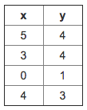
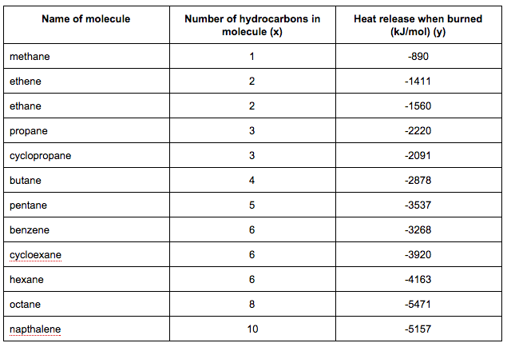

Quiz: Linear Regression with One Variable
==========================================

**Q1.** Consider the problem of predicting how well a student does in her second year of college/university, given 
how well she did in her first year.
   
Specifically, let x be equal to the number of "A" grades (including A-. A and A+ grades) that a student receives 
in their first year of college (freshmen year). We would like to predict the value of y, which we define as the 
number of "A" grades they get in their second year (sophomore year).
   
Here each row is one training example. Recall that in linear regression, our hypothesis is 
hθ(x) = θ0 + θ1x, and we use m to denote the number of training examples.

   
For the training set given above (note that this training set may also be referenced in other questions in this quiz), 
what is the value of m? In the box below, please enter your answer (which should be a number between 0 and 10).

**A1.** 4

**Q2.** Many substances that can burn (such as gasoline and alcohol) have a chemical structure based on carbon atoms; 
for this reason they are called hydrocarbons. A chemist wants to understand how the number of carbon atoms in a 
molecule affects how much energy is released when that molecule combusts (meaning that it is burned). The chemist 
obtains the dataset below. In the column on the right, “kJ/mol” is the unit measuring the amount of energy released.

You would like to use linear regression hθ(x) = θ0 + θ1x to estimate the amount of
 energy released (y) as a function of the number of carbon atoms (x). Which of the following do you think will be 
 the values you obtain for θ0 and θ1? You should be able to select the right answer without 
 actually implementing linear regression.

  1. θ0 = −569.6,  θ1 = −530.9
  1. θ0 = −1780.0, θ1 = −530.9
  1. θ0 = −1780.0,  θ1 = 530.9
  1. θ0 = 569.6,  θ1 = −530.9
  
**A2.** 1

**Q3.** Suppose we set θ0 = 0, θ01/sub> = 1.5 in the linear regression hypothesis from Q1. 
What is hθ(2)?

**A3.** hθ(x) = θ0 + θ1x

hθ(2) = 0 + 1.5 x 3 = 4.5 (Wrong answer)

**Q4.** In the given figure, the cost function J(θ0, θ1) has been plotted against θ0 
and θ1, as shown in 'Plot 2'. The contour plot for the same cost function is given in 'Plot 1'. 
Based on the figure, choose the correct options (check all that apply).

  1. Point P (the global minimum of plot 2) corresponds to point A of Plot 1.
  
  1. If we start from point B, gradient descent with a well-chosen learning rate will eventually help us reach at 
  or near point C, as the value of cost function J(θ0, θ1) is minimum at point C.
  
  1. If we start from point B, gradient descent with a well-chosen learning rate will eventually help us reach at or 
  near point A, as the value of cost function J(θ0, θ1) is maximum at point A.
  
  1. If we start from point B, gradient descent with a well-chosen learning rate will eventually help us reach at or 
  near point A, as the value of cost function J(θ0, θ1) is minimum at A.
  
  1. Point P (The global minimum of plot 2) corresponds to point C of Plot 1.
  

**A4.** 1 and 4

**Q5.** Suppose that for some linear regression problem (say, predicting housing prices as in the lecture), 
we have some training set, and for our training set we managed to find some θ0, θ2
such that J(θ0, θ1) = 0.
        
Which of the statements below must then be true? (Check all that apply.)

  1. This is not possible: By the definition of J(θ0, θ1), it is not possible for there to exist
     θ0 and θ1 so that J(θ0, θ1) = 0.
     
  1. We can perfectly predict the value of _y_ even for new examples that we have not yet seen. (e.g., we can perfectly 
  predict prices of even new houses that we have not yet seen.)
  
  1. For these values of θ0 and θ1 that satisfy J(θ0, θ1) = 0.,
     we have that hθ(x(i)) = y(i) for every training example 
     (x(i), y(i)).
     
  1. For this to be true, we must have θ0 = 0 and θ1 = 0 so that hθ(x) = 0;
  
**A3.** 3