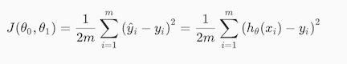

Linear Regression with One Variable
====================================

## Model Representation
To establish notation for future use, we’ll use x(i) to denote the “input” variables (living area in 
this example), also called input features, and y(i) to denote the “output” or target variable that 
we are trying to predict (price). A pair (x(i) , y(i))is called a training example, and the 
dataset that we’ll be using to learn—a list of m training examples (x(i),y(i)); i=1,...,m - is called a training set. 
Note that the superscript “(i)” in the notation is simply an index into the training set, and has nothing 
to do with exponentiation. We will also use X to denote the space of input values, and Y to denote the space of 
output values. In this example, X = Y = ℝ (real number).

To describe the supervised learning problem slightly more formally, our goal is, given a training set, to learn a 
function h : X → Y so that h(x) is a “good” predictor for the corresponding value of y. For historical reasons, 
this function h is called a **hypothesis**. Seen pictorially, the process is therefore like this:

 

When the target variable that we’re trying to predict is _continuous_, such as in our housing example, we call the 
learning problem a **regression problem**. When y can take on only a small number of _discrete values_ (such as if, 
given the living area, we wanted to predict if a dwelling is a house or an apartment, say), we call it a 
**classification problem**.

## Cost Function
We can measure the accuracy of our hypothesis function by using a cost function. This takes an average difference 
(actually a fancier version of an average) of all the results of the hypothesis with inputs from x's and the 
actual output y's.

 

To break it apart, it is &frac12; x&#772; where x&#772; is the mean of the squares of hθ(xi - 
yi), or the difference between the predicted value and the actual value.

This function is otherwise called the "Squared error function", or "Mean squared error". The mean is halved 
(&frac12;) as a convenience for the computation of the gradient descent, as the derivative term of the square 
function will cancel out the (&frac12;) term. The following image summarizes what the cost function does:

 

## Cost Function - Intuition I
If we try to think of it in visual terms, our training data set is scattered on the x-y plane. We are trying to 
make a straight line defined by hθ(x) which passes through these scattered data points.

Our objective is to get the best possible line. The best possible line will be such so that the average squared 
vertical distances of the scattered points from the line will be the least. Ideally, the line should pass through all 
the points of our training data set. In such a case, the value of J(θ0, θ1) will be 0. 
The following example shows the ideal situation where we have a cost function of 0.

 

When θ1 = 1, we get a slope of 1 which goes through every single data point in our model. Conversely, 
when θ1 = = 0.5, we see the vertical distance from our fit to the data points increase.

 

This increases our cost function to 0.58. Plotting several other points yields to the following graph:

 

Thus as a goal, we should try to minimize the cost function. In this case, θ1 = 1 is our global minimum.

## Cost Function - Intuition II
A contour plot is a graph that contains many contour lines. A contour line of a two variable function has a constant 
value at all points of the same line. An example of such a graph is the one to the right below.

 

Taking any color and going along the 'circle', one would expect to get the same value of the cost function. 
For example, the three green points found on the green line above have the same value for 
J(θ0, θ1) and as a result, they are found along the same line. The circled x displays the 
value of the cost function for the graph on the left when θ0 = 800 and θ1 = -0.15. Taking 
another h(x) and plotting its contour plot, one gets the following graphs:

 

When θ0 = 360 and θ1 = 0, the value of J(θ0, θ1) in the contour plot 
gets closer to the center thus reducing the cost function error. Now giving our hypothesis function a slightly 
positive slope results in a better fit of the data.

 

The graph above minimizes the cost function as much as possible and consequently, the result of θ0 
and θ1 tend to be around 0.12 and 250 respectively. Plotting those values on our graph to the right 
seems to put our point in the center of the inner most 'circle'.