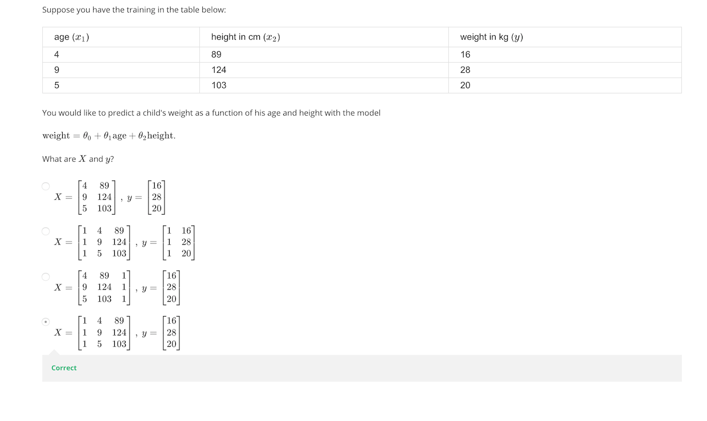

Computing Parameters Analytically
=====================================

## Normal Equation

**Note:** [8:00 to 8:44 - The design matrix X (in the bottom right side of the 
slide) given in the example should have elements x with subscript 1 and 
superscripts varying from 1 to m because for all m training sets there are 
only 2 features x0 and x1. 12:56 - The X matrix is 
m by (n+1) and NOT n by n. ]

Gradient descent gives one way of minimizing J. Let’s discuss a second way of 
doing so, this time performing the minimization explicitly and without 
resorting to an iterative algorithm. In the "Normal Equation" method, we will 
minimize J by explicitly taking its derivatives with respect to the θj ’s, and 
setting them to zero. This allows us to find the optimum theta without 
iteration. The normal equation formula is given below:

_θ = (XT X)−1XTy_

There is **no need** to do feature scaling with the normal equation.

The following is a comparison of gradient descent and the normal equation:

| Gradient Descent              | Normal Equation                                                |
| ----------------------------- | -------------------------------------------------------------- |
| Need to choose alpha          | No need to choose alpha                                        |
| Needs many iterations         | No need to iterate                                             |
| O (kn2)            | O (n3), need to calculate inverse of XTX |
| Works well when n is large    | Slow if n is very large                                        |

With the normal equation, computing the inversion has complexity 
O(n3). So if we have a very large number of features, the normal 
equation will be slow. In practice, when n exceeds 10,000 it might be a good 
time to go from a normal solution to an iterative process.

## Normal Equation Noninvertibility

When implementing the normal equation in octave we want to use the 'pinv' 
function rather than 'inv.' The 'pinv' function will give you a value of θ 
even if XTX is not invertible.

If  XTXis noninvertible, the common causes might be having:

  - Redundant features, where two features are very closely related 
  (i.e. they are linearly dependent)
  
  - Too many features (e.g. m ≤ n). In this case, delete some features or use 
  "regularization" (to be explained in a later lesson).
  
Solutions to the above problems include deleting a feature that is linearly 
dependent with another or deleting one or more features when there are 
too many features.
