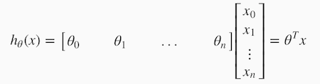
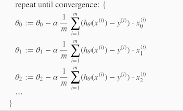
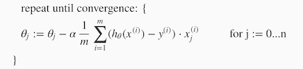
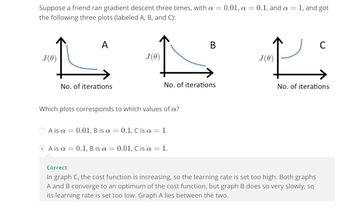
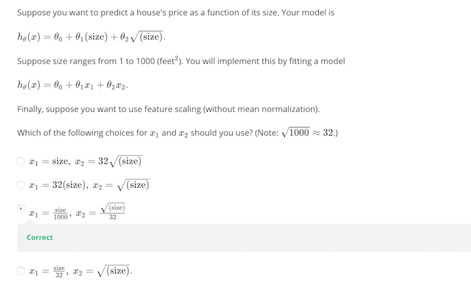

Multivariate Linear Regression
==================================

## Multiple Features
Note: [7:25 - θT is a 1 by (n+1) matrix and not an (n+1) by 1 matrix]

Linear regression with multiple variables is also known as "multivariate linear regression".

We now introduce notation for equations where we can have any number of input variables.

_xj(i)_ = value of feature _j_ in the _ith_ training example

_x(i)_ = the input (features) of the _ith_ training example

_m_ = the number of training examples

_n_ = the number of features

The multivariable form of the hypothesis function accommodating these multiple features is as follows:

_hθ(x) = θ0 + θ1x1 + θ2x2 + 
θ3x3 + ... + θnxn_

In order to develop intuition about this function, we can think about θ0 as the basic price of a house, 
θ1 as the price per square meter, θ2 as the price per floor, etc. x1 will be the 
number of square meters in the house, x2 the number of floors, etc.

Using the definition of matrix multiplication, our multivariable hypothesis function can be concisely represented as:

This is a vectorization of our hypothesis function for one training example; see the lessons on vectorization 
to learn more.

Remark: Note that for convenience reasons in this course we assume x0(i) = 1 for (i ∈ 1, …, m). 
This allows us to do matrix operations with theta and x. Hence making the two vectors 'θ' and x(i)
match each other element-wise (that is, have the same number of elements: n+1).]

## Gradient Descent For Multiple Variables

The gradient descent equation itself is generally the same form; we just have 
to repeat it for our 'n' features:

In other words:

The following image compares gradient descent with one variable to gradient 
descent with multiple variables:

## Gradient Descent in Practice I - Feature Scaling

Note: [6:20 - The average size of a house is 1000 but 100 is accidentally written instead]

We can speed up gradient descent by having each of our input values in roughly 
the same range. This is because θ will descend quickly on small ranges and 
slowly on large ranges, and so will oscillate inefficiently down to the 
optimum when the variables are very uneven.

The way to prevent this is to modify the ranges of our input variables so that 
they are all roughly the same. Ideally:

−1 ≤ x(i) ≤ 1

or

−0.5 ≤ x(i) ≤ 0.5

These aren't exact requirements; we are only trying to speed things up. 
The goal is to get all input variables into roughly one of these ranges, 
give or take a few.

Two techniques to help with this are **feature scaling** and **mean normalization**. 
Feature scaling involves dividing the input values by the range (i.e. the 
maximum value minus the minimum value) of the input variable, resulting in a 
new range of just 1. Mean normalization involves subtracting the average value 
for an input variable from the values for that input variable resulting in a 
new average value for the input variable of just zero. To implement both of 
these techniques, adjust your input values as shown in this formula:

​xi := (xi − μi)/ si

Where μi is the average of all the values for feature (i) and 
si is the range of values (max - min), or si is the 
standard deviation.

Note that dividing by the range, or dividing by the standard deviation, 
give different results. The quizzes in this course use range - 
the programming exercises use standard deviation.

For example, if xi represents housing prices with a range of 
100 to 2000 and a mean value of 1000, then, 
xi := (price-1000)/1900

## Gradient Descent in Practice II - Learning Rate

**Note:** [5:20 - the x -axis label in the right graph should be θ rather than 
No. of iterations ]

**Debugging gradient descent**. Make a plot with _number of iterations_ on 
the x-axis. Now plot the cost function, J(θ) over the number of iterations of 
gradient descent. If J(θ) ever increases, then you probably need to decrease α.

**Automatic convergence test**. Declare convergence if J(θ) decreases by 
less than E in one iteration, where E is some small value such as 10−3. 
However in practice it's difficult to choose this threshold value.
 ​	 
 
 
It has been proven that if learning rate α is sufficiently small, then J(θ) 
will decrease on every iteration.

 ​		
To summarize:

If α is too small: slow convergence.

If α is too large: may not decrease on every iteration and thus may not converge. 

### Quiz

## Features and Polynomial Regression
We can improve our features and the form of our hypothesis function in a 
couple different ways.

We can combine multiple features into one. For example, we can combine 
x1 and x2 into a new feature x3
by taking x1⋅x2.

### Polynomial Regression
Our hypothesis function need not be linear (a straight line) if that does 
not fit the data well.

We can change the behavior or curve of our hypothesis function by making it a 
quadratic, cubic or square root function (or any other form).

For example, if our hypothesis function is hθ(x) = θ0 + 
θ1x1 then we can create additional features based on 
x1 to get the quadratic function 
hθ(x) = θ0 + θ1x1 + θ2x12
 or the cubic function 
 hθ(x) = θ0 + θ1x1 + θ2x12  + θ3x13
 

In the cubic version, we have created new features x2 and x3 
where x2 = x12 and 
x3 = x13.

To make it a square root function, we could do: 
hθ(x) = θ0 + θ1x1 + θ2&#8730;x1
​	 
​	 

One important thing to keep in mind is, if you choose your features this way 
then feature scaling becomes very important.

eg. if x1 has range 1 - 1000 then range of x12 
becomes 1 - 1000000 and that of  x13 becomes 1 - 1000000000

