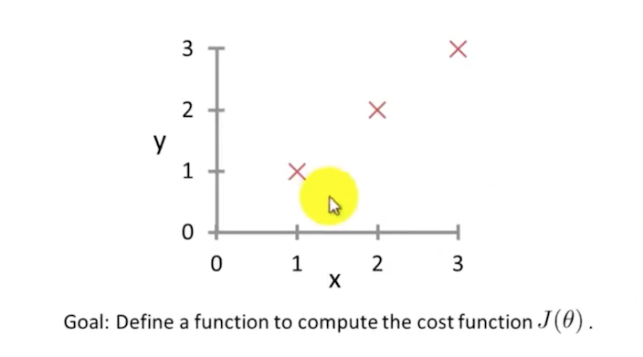

Octave Tutorial
==========================

## Control Statements: for, while, if statement

### For Loop
```
>> v = zeros(10, 1)
v = 
    0
    0
    0
    0
    0
    0
    0
    0
    0
    0
    
>> for i = 1:10,
>    v(i) = 2^i;
>  end;  
v =
    2
    4
    8
   32
   64
  128
  256
  512
 1024
 
>> indices = 1:10;
>> indices
    1  2  3  4  5  6  7  8  9  10

>> for i = indices,
>    disp(i);
>  end;
    1
    2
    3
    4
    5
    6
    7
    8
    9
   10
   
>>  
```

### While Loop

```
>> v
v =
    2
    4
    8
   32
   64
  128
  256
  512
 1024
 
>> i = 1;
>> while i <= 5,
>    v(i) = 0;
>    i = i +1;
>  end;
>> v
v =
  100
  100
  100
  100
  100
  128
  256
  512
 1024
 
```

### If and Break Statement
```
>> i = 1;
>> while true,
>    v(i) = 999;
>    i = i + 1;
>    if (i == 6),
>      break;
>    end;
>  end;
>> v
v =
  999
  999
  999
  999
  999
  128
  256
  512
 1024
```

### If, Elseif and Else Statement
```
>> v(1)
ans = 999

>> v(1) = 2;
>> if v(1) == 1,
>    disp('The value is one');
>  elseif v(1) == 2,
>    disp('The value is two');
>  else
>    disp('The value is not one or two');
>  end;
The value is two
>> 
```

### To exit Octave
Use `exit` or `quit` command.

### Functions
To define a function in Octave, create a file with extension `m`, e.g., 
`squareThisNumber.m`

```
function y = squareThisNumber(x)

y = x^2
```

Now, lets call this function for octave
```
>> squareThisNumber(5)
error: 'squareThisNumber' undefined near line 18 column 1
>> cd 'C:\Users\ang|Desktop'
>> squareThisNumber(5)
ans = 25

>> 
```

### To Modify Octave Search Path
```
>> % Octave search path (advanced/optional)
>> addpath('C:\Users\ang|Desktop')
>> cd 'C:\'
>> squareThisNumber(5)   % Octave still knows the location of the function
   ans = 25
```

### Function that Returns Multiple Values
```
function [y1, y2] = squareAndCubeThisNumber(x)

y1 = x^2;
y2 = x^3;
```

Now back to Octave window,
```
>> [a, b] = squareAndCubeThisNumber(5);
>> a
a = 25
>> b
b = 125
```

### Sophisticated Function Example
Let's say we have a data set that look like this,



Now, lets define the design matrix in Octave,
```
>> X = [1 1; 1 2; 1 3]
X = 
    1    1
    1    2
    1    3
    
>> y = [1; 2; 3]
y = 
    1
    2
    3
    
>>  theta = [0; 1];   
```

Previously defined `costFunctionJ.m`

```
function J = constFunctionJ(X, y, theta)

% X is the "design matrix" containing our training examples
% y is the class labels

m = size(X, 1);    % number of training example
predictions = X * theta;    * predictions of hypothesis of all m examples
sqrErrors = (prediction - y).^2;    % squared errors

J = 1/(2m) * sum(sqrErrors);
```

Now back in Octave,

```
>> j = constFunctionJ(X, y, theta)
j = 0

>> theta = [0, 0];
>> j = constFunctionJ(X, y, theta)
j = 2.3333

>> (1^2 + 2^2 + 3^2)/ (2*3)
j = 2.3333
```