Octave Tutorial
==========================

## Plotting Data

```
>> t = [0:0.01:0.98]; % goes from to 0.98 with increment of 0.01
>> t

>> y1 = sin(2*pi*4*t);
>> plot(t, y1);   %% to plot a graph
```

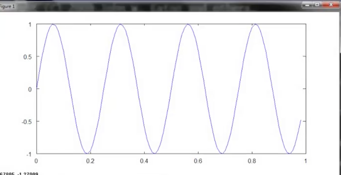

where t is the x-axis while y1 is the y-axis 

```
>> y2 = cos(2*pi*4*t);
>> plot(t, y2);
```

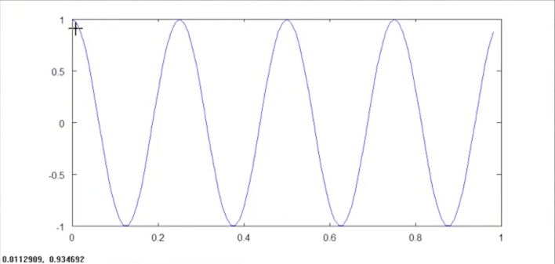

Cosine graph replaces the previous sine graph.

If you want to keep both the graphs,
```
>> plot(t, y1);
>> hold on;   % plots the next graph on the top pf the existing graph
>> plot(t, y2, 'r');    % use color red for plotting
```
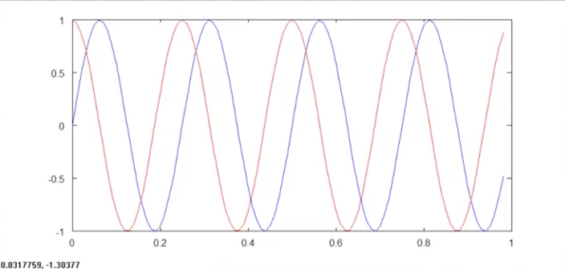

If you want to label hrizontal and vertical axes,
```
>> xlabel('time');
>> ylabel('value');
```

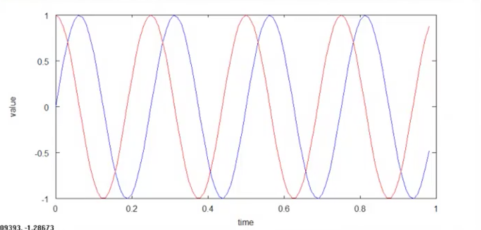

To add legends,
```
>> legend('sin', 'cos');
```
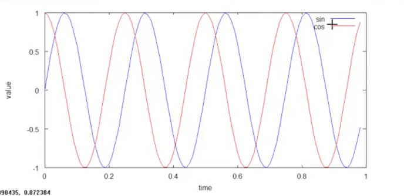

To add title,

```
>> title('my plot')
```


To save this graph on your computer,
```
>> cd 'C:\Users\ang\Desktop';
>> print -dpng 'myplot.png'
```

Octave can also save in other format

To get rid of plot
```
>> close
```

Octave lets you specify figure number. This way you can have multiple graphs open.
```
>> figure(1); plot(t, y1);
>> figure(2); plot(t, y2);
```

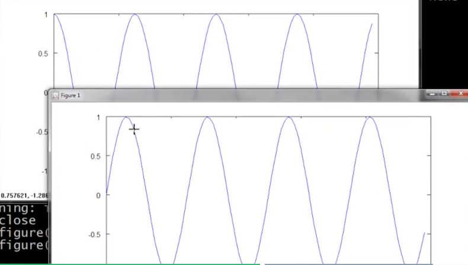

```
>> subplot(1,2,1);    % Divides plot in a 1x2 grid, access first element
```
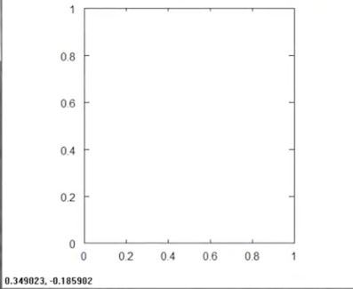

```
>> plot(t, y1);
```
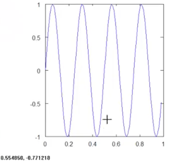

```
subplot(1,2,2);
```
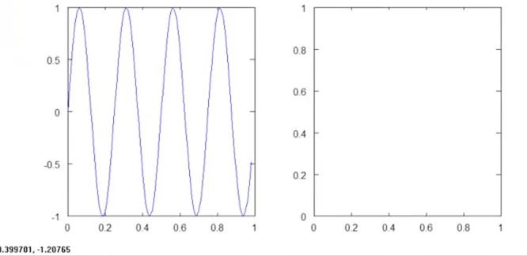

```
>> plot(t, y2);
```

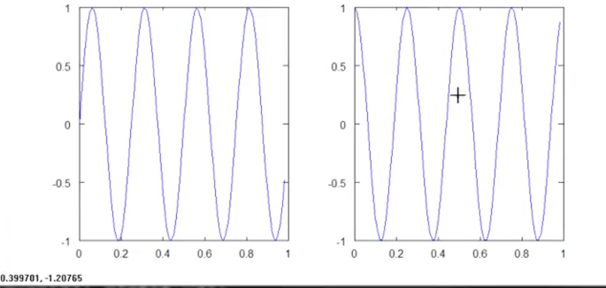

To set the axis range in second graph

```
>> axis([0.5 1 -1 1]
```

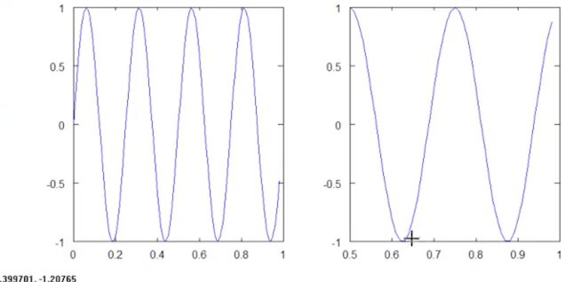

```
>> help axis

>> clf  % clears a figure

>> A = magic(5)

>> imagesc(A)  % plots this matrix as 5 x 5 grid of colors where different
% colors corrsponds to different values of A matrix

```

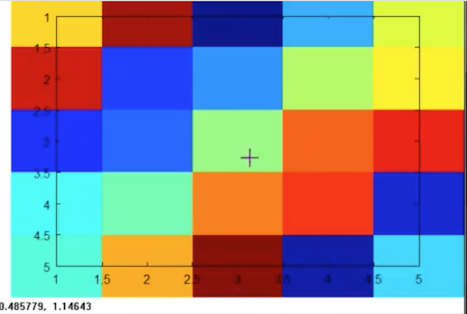

```
>> images(A), colorbar, colormap gray; % running 3 commands at a time
% displays as gray color map, also puts a color bar on the right shows different
% shades of color corresponds to

>> A(1,2)
ans = 24

>> A(4,5)
ans = 3
```
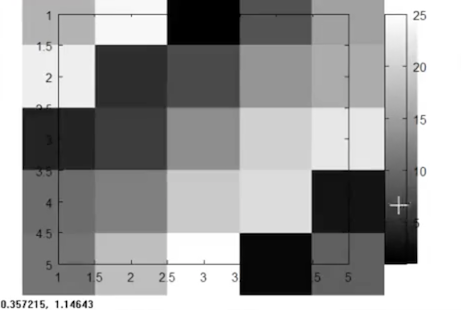

```
>> images(magic(15)), colorbar, colormap gray;
```


Comma chaining functions,
```
>> a=1, b=2, c=3
a = 1
b = 2
c = 3

>> a=1; b=2=; c=3;   % doesn't print out anything
```