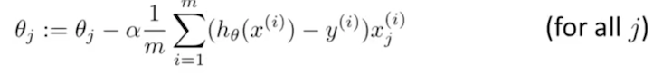
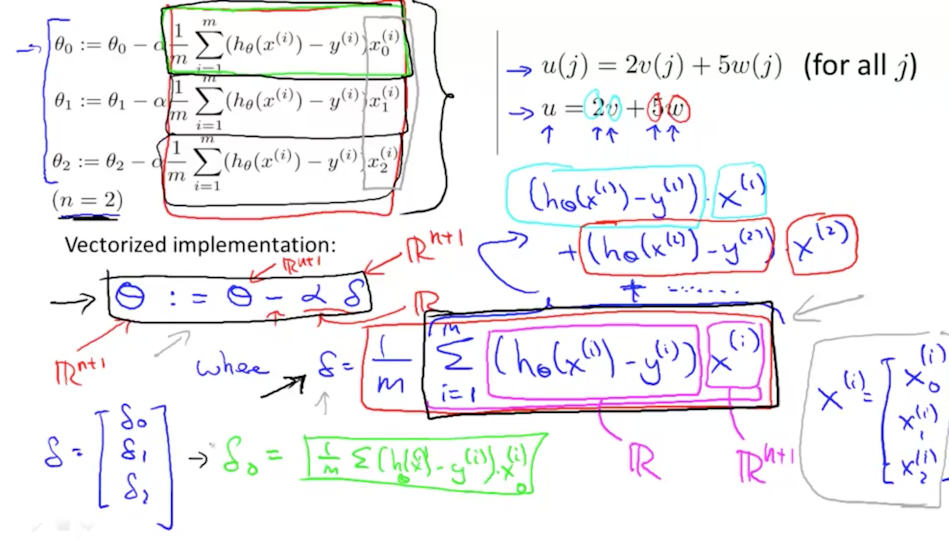
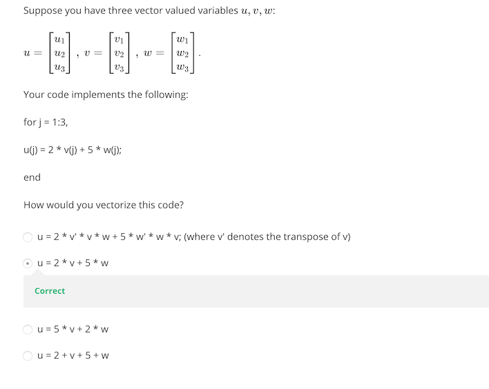

Octave Tutorial
==========================

## Vectorization

### Vectorization Example

h<sub>θ</sub>(x) = 	&#931;<sup>n</sup><sub>j=0</sub> θ<sub>j</sub>x<sub>j</sub>

You can think this as,

h<sub>θ</sub>(x) = θ<sup>T</sup>x

where,

```
      | θo |                | x0 |
 θ =  | θ1 |           x =  | x1 |
      | θ2 |                | x2 |
```

#### Unvectorized Implementation
```
prediction = 0.0;
for j 1:n + 1,
  prediction = prediction + theta(j) + x(j);
end;
```

#### Vectorized Implementation
```
prediction = theta' * x;
```

Always use vector implementation  to take advantage of highly optimized
numerical libraries in Octave or any other programming language.

#### Unvectorized Implementation in C++
```
double prediction = 0.0;
for (int j = 0; j <= n; j++) {
  prediction = prediction + theta(j) + x(j);
}
```

#### Vectorized Implementation in C++
```
double prediction = theta.transpose() * x;
```

### Gradient Descent




