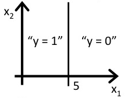
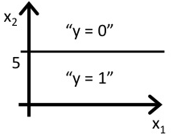
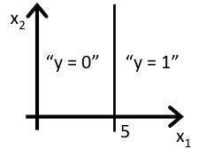

Classification and Representation
=====================================

## Classification

To attempt classification, one method is to use linear regression and map all 
predictions greater than 0.5 as a 1 and all less than 0.5 as a 0. However, 
this method doesn't work well because classification is not actually a 
linear function.

The classification problem is just like the regression problem, except that 
the values we now want to predict take on only a small number of discrete 
values. For now, we will focus on the **binary classification problem** in which 
y can take on only two values, 0 and 1. (Most of what we say here will also 
generalize to the multiple-class case.) For instance, if we are trying to 
build a spam classifier for email, then x<sup>(i)</sup> may be some features 
of a piece of email, and y may be 1 if it is a piece of spam mail, and 0 
otherwise. Hence, y ∈ {0, 1}. 0 is also called the negative class, and 1 
the positive class, and they are sometimes also denoted by the symbols 
“-” and “+.” Given x<sup>(i)</sup>, the corresponding y<sup>(i)</sup> is also 
called the label for the training example.
  
**Q.** Which of the following statements is true?

  1. If linear regression doesn't work on a classification task as in the 
  previous example shown in the video, applying feature scaling may help.
  
  1. If the training set satisfies 0 ≤ y(i) ≤1 for every training example 
  (x<sup>(i)</sup>, y<sup>(i)</sup>), then linear regression's prediction 
  will also satisfy 0 ≤ h<sub>θ</sub>(x) ≤ 1 for all values of x.
  
  1. If there is a feature xx that perfectly predicts y, i.e. if y = 1 when 
  x ≥ c and y = 0 whenever x < c (for some constant c), then linear regression 
  will obtain zero classification error.
  
  1. **None of the above statements are true.**
  
## Hypothesis Representation

We could approach the classification problem ignoring the fact that y is 
discrete-valued, and use our old linear regression algorithm to try to predict 
y given x. However, it is easy to construct examples where this method performs 
very poorly. Intuitively, it also doesn’t make sense for h<sub>θ</sub>(x) to 
take values larger than 1 or smaller than 0 when we know that y ∈ {0, 1}. To 
fix this, let’s change the form for our hypotheses h<sub>θ(x) to satisfy 
0 ≤ h<sub>θ</sub>(x) ≤ 1. This is accomplished by plugging θ<sup>T</sup>x 
into the Logistic Function.

Our new form uses the "Sigmoid Function," also called the "Logistic Function":

h<sub>θ</sub>(x) = g(θ<sup>T</sup>x)

z = θ<sup>T</sup>x

g(z)=  1/(1 + e<sup>−z</sup>)

The following image shows us what the sigmoid function looks like:


The function g(z), shown here, maps any real number to the (0, 1) interval, 
making it useful for transforming an arbitrary-valued function into a function 
better suited for classification.


h<sub>θ</sub>(x) will give us the probability that our output is 1. 
For example, h<sub>θ</sub>(x) = 0.7 gives us a probability of 70% that our 
output is 1. Our probability that our prediction is 0 is just the complement 
of our probability that it is 1 (e.g. if probability that it is 1 is 70%, then 
the probability that it is 0 is 30%).

h<sub>θ</sub>(x) = P(y = 1|x;θ) = 1 − P(y = 0|x;θ)

P(y = 0|x;θ) + P(y = 1|x;θ) = 1

**Q.** Suppose we want to predict, from data x about a tumor, whether it is 
malignant (y = 1) or benign (y = 0). Our logistic regression classifier outputs, 
for a specific tumor, h<sub>θ</sub>(x) = P(y = 1∣x;θ) = 0.7, so we estimate 
that there is a 70% chance of this tumor being malignant. What should be our 
estimate for P(y = 0∣x;θ), the probability the tumor is benign?  

  1. **P(y = 0∣x;θ) = 0.3**
  1. P(y = 0∣x;θ) = 0.7
  1. P(y = 0∣x;θ) = 0.7<sup>2</sup>
  1. P(y = 0∣x;θ) = 0.3 × 0.7
  
## Decision Boundary

In order to get our discrete 0 or 1 classification, we can translate the output
 of the hypothesis function as follows:
 
 h<sub>θ</sub>(x) ≥ 0.5 → y = 1
 
 h<sub>θ</sub>(x) < 0.5 → y = 0
 
The way our logistic function g behaves is that when its input is greater 
than or equal to zero, its output is greater than or equal to 0.5:

g(z) ≥ 0.5 

when z ≥ 0

Remember.

z = 0, e<sup>0</sup> = 1 ⇒ g(z) = 1/2

z → ∞, e<sup>−∞</sup> → 0 ⇒ g(z) = 1

z→ − ∞, e<sup>∞</sup> → ∞ ⇒ g(z) = 0

So if our input to g is θ<sup>T</sup>X, then that means:

h<sub>θ</sub>(x) = g(θ<sup>T</sup>) ≥ 0.5 

when θ<sup>T</sup>x ≥ 0

From these statements we can now say:

θ<sup>T</sup>x ≥ 0 ⇒ y = 1

θ<sup>T</sup>x < 0 ⇒ y = 0

The **decision boundary** is the line that separates the area where y = 0 and
 where y = 1. It is created by our hypothesis function.

```
     |   5 |
 θ = | - 1 |
     |   0 |
``` 
y= 1 if 5 + (−1)x<sub>1</sub> + 0x<sub>2</sub> ≥ 0

5 − x<sub>1</sub> ≥ 0

−x<sub>1</sub> ≥ − 5

x<sub>1</sub> ≤ 5

In this case, our decision boundary is a straight vertical line placed on the 
graph where x<sub>1</sub> = 5, and everything to the left of that denotes 
y = 1, while everything to the right denotes y = 0.

Again, the input to the sigmoid function g(z) (e.g.θ<sup>T</sup>X) doesn't 
need to be linear, and could be a function that describes a circle 
(e.g. z = θ<sub>0</sub> + θ<sub>1</sub>x<sub>1</sub><sup>2</sup> +
θ<sub>2</sub>x<sub>2</sub><sup>2</sup>) or any shape to fit our data.


**Q.** Consider logistic regression with two features x<sub>1</sub> and 
x<sub>2</sub>. Suppose θ<sub>0</sub> = 5, θ<sub>1</sub> = − 1, 
θ<sub>2</sub> = 0, so that h<sub>θ</sub>(x) = g(5 − x<sub>1</sub>). Which of 
these shows the decision boundary of h<sub>θ</sub>(x)?  



Correct: 

Predict Y = 0 if x<sub>1</sub> is greater than 5.




  
  
  
