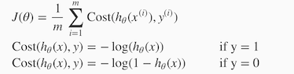
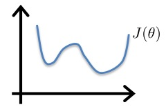
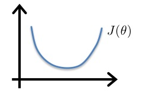
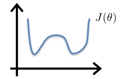
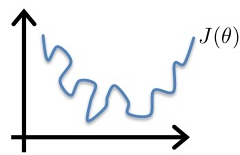

Logistic Regression Model
===========================

## Cost Function

We cannot use the same cost function that we use for linear regression because 
the Logistic Function will cause the output to be wavy, causing many local 
optima. In other words, it will not be a convex function.

Instead, our cost function for logistic regression looks like:

J(θ) = 1/m ∑m i=1 Cost(hθ(x(i)), y(i))

When y = 1, we get the following plot for J(θ) vs hθ(x):

Similarly, when y = 0, we get the following plot for J(θ) vs hθ(x):

Cost(hθ(x), y) = 0 if hθ(x) = y

Cost(hθ(x), y) → ∞ if y = 0 and hθ(x) → 1

Cost(hθ(x), y) → ∞ if y = 1 and hθ(x) → 0 

If our correct answer 'y' is 0, then the cost function will be 0 if our 
hypothesis function also outputs 0. If our hypothesis approaches 1, then the 
cost function will approach infinity.

If our correct answer 'y' is 1, then the cost function will be 0 if our
 hypothesis function outputs 1. If our hypothesis approaches 0, then the 
 cost function will approach infinity.
 
 Note that writing the cost function in this way guarantees that J(θ) is 
 convex for logistic regression.

**Q.** Consider minimizing a cost function J(θ). Which one of these 
functions is convex?

Correct 

**Q.** In logistic regression, the cost function for our hypothesis outputting 
(predicting) hθ(x) on a training example that has label y ∈ {0, 1} is:

cost(hθ(x), y) = −loghθ(x)           if y = 1

cost(hθ(x), y) = −log(1- hθ(x))      if y = 0

Which of the following are true? Check all that apply.

  **1.** If hθ(x) = y, then cost(hθ(x), y) = 0 
  (for y = 0 and y = 1).
  
  **1.** If y = 0, then cost(hθ(x), y) → ∞ as hθ(x) → 1.
  
  1. If y = 0, then cost(hθ(x), y) → ∞ as hθ(x) → 0.
  
  **1.** Regardless of whether y = 0 or y = 1, if hθ(x) = 0.5, then 
  cost(hθ(x), y)> 0.

​## Simplified Cost Function and Gradient Descent

