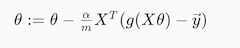

Logistic Regression Model
===========================

## Cost Function

We cannot use the same cost function that we use for linear regression because 
the Logistic Function will cause the output to be wavy, causing many local 
optima. In other words, it will not be a convex function.

Instead, our cost function for logistic regression looks like:

J(θ) = 1/m ∑m i=1 Cost(hθ(x(i)), y(i))

When y = 1, we get the following plot for J(θ) vs hθ(x):

Similarly, when y = 0, we get the following plot for J(θ) vs hθ(x):

Cost(hθ(x), y) = 0 if hθ(x) = y

Cost(hθ(x), y) → ∞ if y = 0 and hθ(x) → 1

Cost(hθ(x), y) → ∞ if y = 1 and hθ(x) → 0 

If our correct answer 'y' is 0, then the cost function will be 0 if our 
hypothesis function also outputs 0. If our hypothesis approaches 1, then the 
cost function will approach infinity.

If our correct answer 'y' is 1, then the cost function will be 0 if our
 hypothesis function outputs 1. If our hypothesis approaches 0, then the 
 cost function will approach infinity.
 
 Note that writing the cost function in this way guarantees that J(θ) is 
 convex for logistic regression.

**Q.** Consider minimizing a cost function J(θ). Which one of these 
functions is convex?

Correct 

**Q.** In logistic regression, the cost function for our hypothesis outputting 
(predicting) hθ(x) on a training example that has label y ∈ {0, 1} is:

cost(hθ(x), y) = −loghθ(x)           if y = 1

cost(hθ(x), y) = −log(1- hθ(x))      if y = 0

Which of the following are true? Check all that apply.

  1. If hθ(x) = y, then cost(hθ(x), y) = 0 
  (for y = 0 and y = 1). (**True**)
  
  1. If y = 0, then cost(hθ(x), y) → ∞ as hθ(x) → 1. (**True**)
  
  1. If y = 0, then cost(hθ(x), y) → ∞ as hθ(x) → 0.
  
  1. Regardless of whether y = 0 or y = 1, if hθ(x) = 0.5, then 
cost(hθ(x), y) > 0. (**True**)

## Simplified Cost Function and Gradient Descent

Note: [6:53 - the gradient descent equation should have a 1/m factor]

We can compress our cost function's two conditional cases into one case:

Cost(hθ(x), y) = −ylog(hθ(x)) − (1 − y)log(1 − hθ(x))

Notice that when y is equal to 1, then the second term (1 − y)log(1 − hθ(x))
will be zero and will not affect the result. If y is equal to 0, then the first 
term −ylog(hθ(x)) will be zero and will not affect the result.

We can fully write out our entire cost function as follows:

J(θ) = −1/m ∑i=1m[y(i)
  log(hθ(x(i)) + (1 − y(i))log(1 − hθ(x(i)))] 
  
A vectorized implementation is:

h = g(Xθ)

J(θ) = 1/m⋅(−yTlog(h) − (1 − y)Tlog(1 − h))

### Gradient Descent

Remember that the general form of gradient descent is:

Repeat {

θj := θj − α * ∂/∂θj J(θ)

}

We can work out the derivative part using calculus to get:

Repeat {

θj := θj − α/m * ∑mi=1(
 hθ(x(i)) - y(i))xj(i))

}

Notice that this algorithm is identical to the one we used in linear regression.
 We still have to simultaneously update all values in theta.

A vectorized implementation is:

θ := θ − α/m XT(g(Xθ) − y)

_______________

**Q.** Suppose you are running gradient descent to fit a logistic regression model 
with parameter θ ∈ Rn+1. Which of the following is a reasonable way 
to make sure the learning rate α is set properly and that gradient descent is 
running correctly?

  1. Plot J(θ)= 1/m ∑i=1m(hθ(x(i))
  − y(i))2 as a function of the number of iterations 
  (i.e. the horizontal axis is the iteration number) and make sure J(θ) is 
  decreasing on every iteration.
  
  1. Plot J(θ) = −1/m ∑i=1m[y(i)
  log(hθ(x(i)) + (1 − y(i))log(1 − hθ(x(i)))] 
  as a function of the number of iterations and make sure J(θ) is decreasing 
  on every iteration. (**True**)
  
  1. Plot J(θ) as a function of θ and make sure it is decreasing on every 
  iteration.
  
  1. Plot J(θ) as a function of θ and make sure it is convex.
  
_______________

**Q.** One iteration of gradient descent simultaneously performs these updates:

θ0 := θ0 − α.1/m ∑i=1m
(hθ(x(i)) − y(i)).x0(i)

θ1 := θ1 − α.1/m ∑i=1m
(hθ(x(i)) − y(i)).x1(i)

...

θn := θ1 − α.1/m ∑i=1m
(hθ(x(i)) − y(i)).xn(i)

We would like a vectorized implementation of the form θ := θ − αδ (for some 
vector δ ∈ Rn+1).

What should the vectorized implementation be?

  1. θ := θ − α.1/m ∑i=1m
     [(hθ(x(i)) − y(i)).x(i)] (**True**)
     
  1. θ := θ − α.1/m [∑i=1m
       (hθ(x(i)) − y(i))].x(i)
  
  1. θ := θ − α.1/m x(i)[∑i=1m
         (hθ(x(i)) − y(i))]
         
  1. All of the above are correct implementations.
​	

